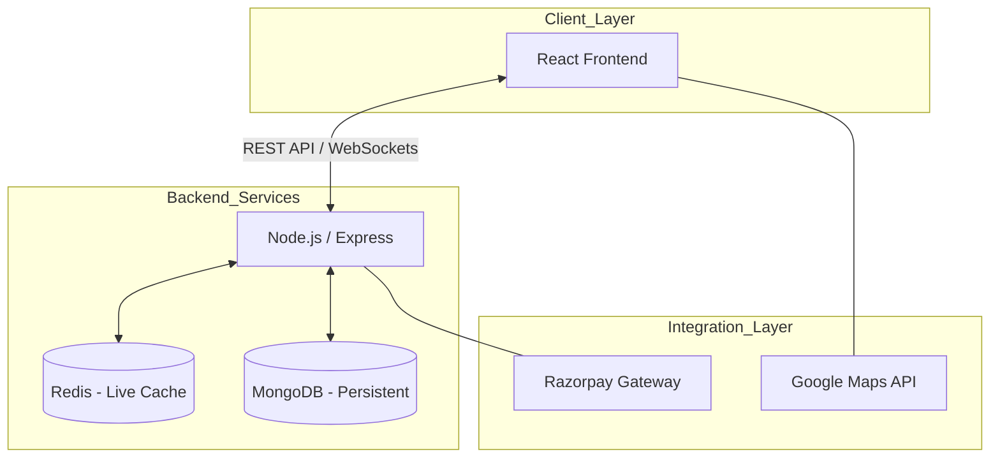

# 🚌 Where Is My Bus – Real-Time Bus Tracking & Booking System
**Where Is My Bus** is a full-stack web application designed to help users search, track, and book buses in real time. The platform provides live bus location tracking on maps, route-based search, ticket booking with online payment, and nearby place discovery to improve the daily commuting experience.

This project is built with a modern tech stack and follows open-source best practices, making it beginner-friendly and scalable.

---

## 🚀 Features
- 🔍 Search buses by **Route (From & To)**, **Bus Name**, or **Bus ID**
- 📍 **Real-time bus tracking** on an interactive map
- 🗺️ View **nearby buses** and important places (Hospitals, Schools, Clinics)
- 🎫 **Bus ticket booking & cancellation**
- 💳 Secure online payments using **Razorpay**
- 🌐 **Multi-language support**
- 👤 User authentication & profile management
- 🧾 View booking history and tickets
- ⚠️ Proper error handling and validations

---

## 🧑‍💻 Target Audience
- Daily commuters
- Travelers using public transportation
- Users who need real-time bus location updates
- Transport management systems
---

## 🏗️ Project Architecture

This project follows a clean **client–server architecture** where responsibilities are
clearly divided between the Frontend and Backend. This separation makes the system
scalable, maintainable, and easy for new contributors to understand.

---
### 🎨 Frontend
---

The Frontend is responsible for everything the user sees and interacts with:

- Rendering the complete user interface using React
- Allowing users to search buses, view routes, and track buses on the map
- Displaying real-time bus locations using Google Maps
- Handling user actions like login, booking, and cancellation
- Communicating with backend APIs to fetch and send data

In simple terms, the frontend acts as the **presentation layer** that converts raw data
into a smooth and interactive user experience.

---

### 🔙 Backend
---

The Backend acts as the core logic layer of the system and is responsible for:

- Managing users, authentication, and profiles
- Handling bus data, routes, and bookings
- Processing ticket creation and cancellations
- Integrating Razorpay for secure payments
- Receiving and updating real-time bus location data
- Serving structured APIs for the frontend to consume

It works as the **brain of the application**, where all business logic and data handling
takes place.

---

### 🔄 Overall Workflow
---

High-level flow of the system:

1. The user opens the web application in the browser.
2. The Frontend sends requests to the Backend APIs.
3. The Backend:
   - Fetches or updates data in the database
   - Handles business logic (search, booking, tracking, payments)
4. The Backend returns processed responses to the Frontend.
5. The Frontend updates the UI with maps, bus locations, and user data.
---

### This architecture ensures
---

- Clear separation of concerns  
- Better scalability and maintainability  
- Easier onboarding for new contributors  
- Reliable real-time updates and data flow
---

##  Tech Stack

### Frontend
---
- React (Vite)
- JavaScript
- Google Maps API
- HTML, CSS
---
### Backend
---
- Node.js
- Express.js
- MongoDB
- (Optional) Redis for caching
- JWT-based authentication
- Auth0 (optional integrations)
- Razorpay for payments
- OpenAI API (optional features)
---

### 🛠️ Technical Deep Dive
---
#### 📍 Real-Time Data Flow
---
1. **Emitter:** The bus location is sent via a post request or socket to the backend.
2. **Caching:** To prevent database bottlenecks, the latest coordinates are stored in **Redis**.
3. **Consumption:** The Frontend fetches the latest coordinates from the Redis cache via the `/tracking` endpoint.
4. **Rendering:** Coordinates are fed into the Google Maps SDK to move the bus marker in real-time.
---

#### 💳 Payment & Security Flow
---
We use **Razorpay** for secure transactions:
- **Order Creation:** Backend creates a `razorpay_order_id`.
- **Payment:** Frontend handles the UI; the user pays via Razorpay.
- **Verification:** Razorpay sends a **Webhook** or callback to our backend. We verify the `razorpay_signature` using the `RAZORPAY_SECRET` before confirming the ticket in MongoDB.

---

## Project Structure

```bash
GPS_Tracker/
├── Backend/
│   ├── controllers/
│   ├── models/
│   ├── routes/
│   ├── middleware/
│   ├── utils/
│   ├── package.json
│   └── index.js
│
├── Frontend/
│   ├── src/
│   ├── public/
│   ├── package.json
│   └── vite.config.js
│
└── README.md
```

---

## 🏗️ System Architecture
To ensure high performance for real-time tracking, the system separates persistent data (MongoDB) from volatile, high-frequency updates (Redis).


---

## ⚙️ Installation & Setup

```bash
git clone https://github.com/ayanmanna123/GPS_Tracker.git
cd GPS_Tracker
```
### 🔧 Backend Setup
```bash
cd Backend
npm install
```
### 🔧 Environment Variables Reference
| Key | Description | Source |
| :--- | :--- | :--- |
| `MONGO_URI` | Connection string for MongoDB Atlas | [MongoDB](https://mongodb.com) |
| `REDIS_URI` | Connection string for Redis (Local or Cloud) | [Redis](https://redis.io) |
| `AUTH0_DOMAIN` | Your Auth0 Tenant Domain | [Auth0](https://auth0.com) |
| `RAZORPAY_SECRET` | Secret key for payment verification | [Razorpay](https://dashboard.razorpay.com) |
| `GOOGLE_API_KEY` | Key for Maps, Places, and Geocoding | [Google Console](https://console.cloud.google.com) |
**Start Server**
```bash
npm run dev
```
**Backend will run on:**
```bash
http://localhost:5000
```
### 🎨 Frontend Setup
```bash
cd Frontend
npm install
```
**Create `.env` file in `frontend/`**
```bash
VITE_BASE_URL=http://localhost:5000/api/v1
```
**Start Frontend**
```bash
npm run dev
```
**Frontend will run on:**
```bash
http://localhost:5173
```
**Steps to run both Frontend and Backend:**
```bash
cd Frontend
npm run both
```
### 📡 API Reference
| Endpoint | Method | Description |
| :--- | :--- | :--- |
| `/api/v1/buses/search` | `GET` | Search for buses by route or name |
| `/api/v1/tracking/:id` | `GET` | Get real-time GPS from Redis cache |
| `/api/v1/bookings` | `POST` | Create a new bus booking |
| `/api/v1/bookings/user` | `GET` | Get booking history for logged-in user |

---

## Usage

- Register or log in to the platform
- Search buses using route, name, or bus ID
- Track live bus locations on the map
- Book tickets and complete payments
- View and manage booked tickets
- Explore nearby important places

---

## Contributors

Thanks to everyone who has contributed to this project.

<a href="https://github.com/ayanmanna123/GPS_Tracker/graphs/contributors">
  
</a>

Contributions are welcome — see `CONTRIBUTING.md` for details.

---

## Contribution Guidelines

- Fork the repository
- Create a new branch for your feature or fix
- Commit with clear messages
- Open a pull request with a descriptive title and summary

Beginner-friendly issues are labeled for new contributors.

---

## Future Enhancements

- Push notifications for bus arrival
- Mobile app integration
- AI-based route prediction
- Admin dashboard for operators

---

## License

This project is licensed under the [MIT License](./LICENSE).

---

## Support

If you find this project useful, please consider starring it on GitHub.

---

## _Made with ❤️ by Ayan Manna_
