# 🚌 Where Is My Bus – Real-Time Bus Tracking & Booking System

<div align="center">


[](https://opensource.org/licenses/MIT)
[](https://nodejs.org/)
[](https://reactjs.org/)
[](https://www.mongodb.com/)
[](https://redis.io/)
[](https://razorpay.com/)
[](https://auth0.com/)

**Revolutionizing Public Transportation with Real-Time Intelligence**

[🌐 Live Demo](https://whereismybus.netlify.app) • [📖 Documentation](API.md) • [🚀 Quick Start](#-installation--setup) • [🤝 Contributing](CONTRIBUTING.md)

---

</div>

## 📋 Table of Contents

- [✨ Overview](#-overview)
- [🚀 Features](#-features)
- [🎯 Target Audience](#-target-audience)
- [🛠️ Tech Stack](#️-tech-stack)
- [🏗️ Architecture](#️-architecture)
- [📂 Project Structure](#-project-structure)
- [⚙️ Installation & Setup](#️-installation--setup)
- [🧪 Usage](#-usage)
- [📸 Screenshots](#-screenshots)
- [🔧 API Documentation](#-api-documentation)
- [🤝 Contributing](#-contributing)
- [🏆 Contributors](#-contributors)
- [📌 Roadmap](#-roadmap)
- [📜 License](#-license)
- [⭐ Support](#-support)
- [📞 Contact](#-contact)

---

## ✨ Overview

**Where Is My Bus** is a cutting-edge, full-stack web application that transforms the public transportation experience by providing real-time bus tracking, seamless booking, and intelligent route planning. Built with modern technologies and a user-centric design, it empowers commuters with live location data, secure payments, and comprehensive journey management.

Whether you're a daily commuter, a tourist exploring new cities, or a transport operator managing fleets, Where Is My Bus delivers unparalleled visibility and convenience in public transit.

---

## 🚀 Features

### 🔍 **Smart Search & Discovery**
- **Multi-criteria Search**: Find buses by route (from/to), bus name, or unique ID
- **Intelligent Filtering**: Sort by departure time, price, or availability
- **Nearby Places Integration**: Discover hospitals, schools, and clinics along routes

### 📍 **Real-Time Tracking**
- **Live GPS Monitoring**: Track bus locations in real-time on interactive maps
- **ETA Predictions**: Get accurate arrival time estimates
- **Route Visualization**: See complete journey paths with stops and landmarks

### 🎫 **Seamless Booking**
- **One-Click Booking**: Instant ticket reservation with secure payment
- **Multiple Payment Options**: Integrated with Razorpay for safe transactions
- **Booking Management**: View, modify, or cancel bookings with ease

### 🌐 **User Experience**
- **Multi-Language Support**: Accessible in multiple languages
- **Responsive Design**: Optimized for desktop, tablet, and mobile devices
- **Dark/Light Mode**: Customizable interface for user preference

### 👤 **User Management**
- **Secure Authentication**: JWT-based auth with Auth0 integration
- **Profile Management**: Personalized user dashboards
- **Booking History**: Complete transaction and journey records

### 🔔 **Notifications & Alerts**
- **Real-Time Updates**: Push notifications for bus arrivals and delays
- **SMS/Email Alerts**: Configurable notification preferences

### 🤖 **AI-Powered Features** (Optional)
- **Smart Route Suggestions**: AI-driven optimal path recommendations
- **Predictive Analytics**: Anticipate delays and suggest alternatives

---

## 🎯 Target Audience

- **🚶 Daily Commuters**: Students, professionals, and regular travelers
- **🧳 Tourists & Visitors**: Exploring cities with public transport
- **🏢 Transport Operators**: Managing and monitoring bus fleets
- **🏛️ City Planners**: Analyzing transportation patterns
- **📱 Mobile Users**: On-the-go access to transportation information

---

## 🛠️ Tech Stack

### 🎨 Frontend
| Technology | Purpose | Version |
|------------|---------|---------|
|  | UI Framework | 18.x |
|  | Build Tool | 4.x |
|  | Programming Language | ES6+ |
|  | Mapping Service | API v3 |
|  | Styling | 3.x |

### ⚙️ Backend
| Technology | Purpose | Version |
|------------|---------|---------|
|  | Runtime | 18.x |
|  | Web Framework | 4.x |
|  | Database | 6.x |
|  | Caching | 7.x |
|  | Authentication | 9.x |

### 🔧 Additional Tools
| Technology | Purpose |
|------------|---------|
|  | Identity Management |
|  | Payment Gateway |
|  | AI Integration |
|  | Real-Time Communication |

---

## 🏗️ Architecture

```mermaid
graph TB
    A[🌐 Frontend - React/Vite] --> B[🚀 API Gateway - Express.js]
    B --> C[👤 Authentication - Auth0/JWT]
    B --> D[💳 Payment - Razorpay]
    B --> E[📍 Location Services - Google Maps]
    B --> F[🤖 AI Services - OpenAI]

    C --> G[(🗄️ MongoDB)]
    D --> G
    E --> H[(⚡ Redis Cache)]
    F --> H

    I[📡 WebSocket Server] --> A
    I --> J[📱 Mobile Clients]

    K[🚌 GPS Devices] --> L[📊 Tracking Service]
    L --> H
    L --> G

    style A fill:#e1f5fe
    style B fill:#f3e5f5
    style G fill:#e8f5e8
    style H fill:#fff3e0
```



**System Components:**
- **Frontend Layer**: Responsive React application with real-time updates
- **API Layer**: RESTful APIs with GraphQL support for complex queries
- **Data Layer**: MongoDB for persistent storage, Redis for caching
- **Real-Time Layer**: WebSocket connections for live tracking
- **External Services**: Integration with payment gateways and mapping services

---

## 📂 Project Structure

```
GPS_Tracker/
├── 📁 Backend/
│   ├── 📁 controllers/          # Business logic handlers
│   ├── 📁 middleware/           # Authentication & validation
│   ├── 📁 models/              # Database schemas
│   ├── 📁 routes/              # API endpoints
│   ├── 📁 services/            # External service integrations
│   ├── 📁 utils/               # Helper functions
│   ├── 📄 server.js            # Application entry point
│   └── 📄 package.json         # Dependencies & scripts
│
├── 📁 Frontend/
│   ├── 📁 src/
│   │   ├── 📁 components/      # Reusable UI components
│   │   ├── 📁 hooks/           # Custom React hooks
│   │   ├── 📁 services/        # API service functions
│   │   ├── 📁 Redux/           # State management
│   │   └── 📄 App.jsx          # Main application component
│   ├── 📄 vite.config.js       # Build configuration
│   └── 📄 package.json         # Dependencies & scripts
│
├── 📁 docs/                    # Documentation
├── 📄 README.md                # Project documentation
├── 📄 API.md                   # API reference
├── 📄 CONTRIBUTING.md          # Contribution guidelines
└── 📄 LICENSE                  # License information
```

---

## ⚙️ Installation & Setup

### 📋 Prerequisites

Before you begin, ensure you have the following installed:
- **Node.js** (v18 or higher) - [Download](https://nodejs.org/)
- **MongoDB** (v6 or higher) - [Download](https://www.mongodb.com/)
- **Redis** (v7 or higher) - [Download](https://redis.io/)
- **Git** - [Download](https://git-scm.com/)

### 🚀 Quick Start

1. **Clone the Repository**
   ```bash
   git clone https://github.com/ayanmanna123/GPS_Tracker.git
   cd GPS_Tracker
   ```

2. **Environment Setup**
   ```bash
   # Copy environment templates
   cp Backend/.env.example Backend/.env
   cp Frontend/.env.example Frontend/.env
   ```

3. **Backend Configuration**
   ```bash
   cd Backend

   # Install dependencies
   npm install

   # Configure environment variables in .env
   # See ENV_SETUP.md for detailed configuration
   ```

4. **Frontend Configuration**
   ```bash
   cd ../Frontend

   # Install dependencies
   npm install

   # Configure environment variables in .env
   ```

5. **Start Development Servers**
   ```bash
   # Terminal 1: Start Backend
   cd Backend
   npm run dev

   # Terminal 2: Start Frontend
   cd Frontend
   npm run dev
   ```

6. **Access the Application**
   - Frontend: [http://localhost:5173](http://localhost:5173)
   - Backend API: [http://localhost:5000](http://localhost:5000)

### 🐳 Docker Setup (Alternative)

```bash
# Build and run with Docker Compose
docker-compose up --build
```

---

## 🧪 Usage

### 👤 User Journey

1. **Registration/Login**
   - Create account or sign in with Auth0
   - Complete profile setup

2. **Search & Book**
   - Search buses by route or location
   - Select preferred bus and seat
   - Complete secure payment

3. **Track & Travel**
   - Monitor real-time bus location
   - Receive arrival notifications
   - Access journey history

### 🔧 Developer Usage

```javascript
// Example API usage
import { searchBuses, bookTicket } from './services/api';

// Search buses
const buses = await searchBuses({
  from: 'New York',
  to: 'Boston',
  date: '2024-01-15'
});

// Book a ticket
const booking = await bookTicket({
  busId: 'bus123',
  seats: ['A1', 'A2'],
  paymentMethod: 'razorpay'
});
```

---

## 📸 Screenshots

<div align="center">

### 🏠 Homepage


### 🗺️ Live Tracking


### 🎫 Booking Interface


### 👤 User Dashboard


</div>

*📝 Note: Replace placeholder images with actual screenshots from your application*

---

## 🔧 API Documentation

Comprehensive API documentation is available in [API.md](API.md)

### 🚀 Quick API Reference

```http
# Authentication
POST /api/v1/auth/login
POST /api/v1/auth/register

# Bus Operations
GET /api/v1/buses/search?from=NYC&to=BOS
GET /api/v1/buses/{id}/location

# Booking
POST /api/v1/bookings
GET /api/v1/bookings/{id}

# Real-time Updates
WebSocket: ws://localhost:5000/ws/tracking
```

For detailed API specifications, see [API.md](API.md)

---

## 🤝 Contributing

We welcome contributions from developers of all skill levels! 🚀

### 📝 How to Contribute

1. **Fork** the repository
2. **Clone** your fork: `git clone https://github.com/your-username/GPS_Tracker.git`
3. **Create** a feature branch: `git checkout -b feature/amazing-feature`
4. **Make** your changes and test thoroughly
5. **Commit** with clear messages: `git commit -m "Add amazing feature"`
6. **Push** to your branch: `git push origin feature/amazing-feature`
7. **Open** a Pull Request

### 🏷️ Issue Labels

- `🐛 bug` - Bug fixes
- `✨ feature` - New features
- `📚 documentation` - Documentation improvements
- `🔧 enhancement` - Code improvements
- `🎨 ui/ux` - User interface updates
- `🧪 testing` - Test additions/updates

### 📋 Development Guidelines

- Follow [ESLint](https://eslint.org/) rules
- Write comprehensive tests
- Update documentation for API changes
- Ensure responsive design
- Maintain code coverage above 80%

See [CONTRIBUTING.md](CONTRIBUTING.md) for detailed guidelines.

---

## 🏆 Contributors

### 🌟 Core Team

<table>
  <tr>
    <td align="center">
      <a href="https://github.com/ayanmanna123">
        <br />
        <sub><b>Ayan Manna</b></sub>
      </a><br />
      <a href="#projectManagement" title="Project Management">📋</a>
      <a href="#code" title="Code">💻</a>
    </td>
  </tr>
</table>
## 🤝 All Contributors

Thanks goes to these wonderful people ❤️

<!-- ALL-CONTRIBUTORS-LIST:START -->
<!-- prettier-ignore-start -->
<!-- markdownlint-disable -->
<table>
  <tbody>
    <tr>
      <td align="center" valign="top" width="14.28%"><a href="https://github.com/Gupta-02"><br /><sub><b>C Sai Prathyun Gupta</b></sub></a><br /><a href="https://github.com/ayanmanna123/GPS_Tracker/commits?author=Gupta-02" title="Code">💻</a></td>
      <td align="center" valign="top" width="14.28%"><a href="https://github.com/ayanmanna123"><br /><sub><b>Ayan Manna</b></sub></a><br /><a href="https://github.com/ayanmanna123/GPS_Tracker/commits?author=ayanmanna123" title="Code">💻</a></td>
      <td align="center" valign="top" width="14.28%"><a href="https://github.com/santanu-atta03"><br /><sub><b>Santanu Atta</b></sub></a><br /><a href="https://github.com/ayanmanna123/GPS_Tracker/commits?author=santanu-atta03" title="Code">💻</a></td>
      <td align="center" valign="top" width="14.28%"><a href="https://github.com/Kiran95021"><br /><sub><b>shirishala kiran</b></sub></a><br /><a href="https://github.com/ayanmanna123/GPS_Tracker/commits?author=Kiran95021" title="Code">💻</a></td>
      <td align="center" valign="top" width="14.28%"><a href="https://github.com/ShivanshCoding36"><br /><sub><b>Shivansh Mathur</b></sub></a><br /><a href="https://github.com/ayanmanna123/GPS_Tracker/commits?author=ShivanshCoding36" title="Code">💻</a></td>
      <td align="center" valign="top" width="14.28%"><a href="https://gauravkarakoti.netlify.app/"><br /><sub><b>Gaurav Karakoti</b></sub></a><br /><a href="https://github.com/ayanmanna123/GPS_Tracker/commits?author=GauravKarakoti" title="Code">💻</a></td>
      <td align="center" valign="top" width="14.28%"><a href="https://github.com/Namithnp"><br /><sub><b>Namith N P</b></sub></a><br /><a href="https://github.com/ayanmanna123/GPS_Tracker/commits?author=Namithnp" title="Code">💻</a></td>
    </tr>
    <tr>
      <td align="center" valign="top" width="14.28%"><a href="https://my-portfolio-xc1h.onrender.com/"><br /><sub><b>Shubham Singh Rawat</b></sub></a><br /><a href="https://github.com/ayanmanna123/GPS_Tracker/commits?author=ShubhamSinghRawat10" title="Code">💻</a></td>
      <td align="center" valign="top" width="14.28%"><a href="https://github.com/Atharva2093"><br /><sub><b>Atharva2093</b></sub></a><br /><a href="https://github.com/ayanmanna123/GPS_Tracker/commits?author=Atharva2093" title="Code">💻</a></td>
      <td align="center" valign="top" width="14.28%"><a href="https://adarsharya.vercel.app/"><br /><sub><b>ADARSH ARYA</b></sub></a><br /><a href="https://github.com/ayanmanna123/GPS_Tracker/commits?author=GEARdHAX" title="Code">💻</a></td>
      <td align="center" valign="top" width="14.28%"><a href="https://github.com/Suvam18"><br /><sub><b>Suvam Chatterjee </b></sub></a><br /><a href="https://github.com/ayanmanna123/GPS_Tracker/commits?author=Suvam18" title="Code">💻</a></td>
      <td align="center" valign="top" width="14.28%"><a href="https://github.com/lakshya1304"><br /><sub><b>Lakshya Goyal</b></sub></a><br /><a href="https://github.com/ayanmanna123/GPS_Tracker/commits?author=lakshya1304" title="Code">💻</a></td>
      <td align="center" valign="top" width="14.28%"><a href="https://pranitee-portfolio.vercel.app/"><br /><sub><b>Pranitee Kishor Sonavane</b></sub></a><br /><a href="https://github.com/ayanmanna123/GPS_Tracker/commits?author=Pranitee-Sonavane" title="Code">💻</a></td>
      <td align="center" valign="top" width="14.28%"><a href="https://github.com/VyankateshPandit"><br /><sub><b>Vyankatesh Pandit</b></sub></a><br /><a href="https://github.com/ayanmanna123/GPS_Tracker/commits?author=VyankateshPandit" title="Code">💻</a></td>
    </tr>
    <tr>
      <td align="center" valign="top" width="14.28%"><a href="https://github.com/Biswajitn23"><br /><sub><b>Biswajit Nayak</b></sub></a><br /><a href="https://github.com/ayanmanna123/GPS_Tracker/commits?author=Biswajitn23" title="Code">💻</a></td>
      <td align="center" valign="top" width="14.28%"><a href="https://mytoplinks-neeru.netlify.app/"><br /><sub><b>Neeru </b></sub></a><br /><a href="https://github.com/ayanmanna123/GPS_Tracker/commits?author=neeru24" title="Code">💻</a></td>
      <td align="center" valign="top" width="14.28%"><a href="https://github.com/Saisathvik94"><br /><sub><b>Sai Sathvik</b></sub></a><br /><a href="https://github.com/ayanmanna123/GPS_Tracker/commits?author=Saisathvik94" title="Code">💻</a></td>
      <td align="center" valign="top" width="14.28%"><a href="https://github.com/apps/allcontributors"><br /><sub><b>allcontributors[bot]</b></sub></a><br /><a href="https://github.com/ayanmanna123/GPS_Tracker/commits?author=allcontributors[bot]" title="Code">💻</a></td>
      <td align="center" valign="top" width="14.28%"><a href="https://github.com/Neeraj-code-beep"><br /><sub><b>Neeraj Mishra</b></sub></a><br /><a href="https://github.com/ayanmanna123/GPS_Tracker/commits?author=Neeraj-code-beep" title="Code">💻</a></td>
      <td align="center" valign="top" width="14.28%"><a href="https://shrinivasmudabe.me/"><br /><sub><b>Shrinivas Mudabe</b></sub></a><br /><a href="https://github.com/ayanmanna123/GPS_Tracker/commits?author=Shriii19" title="Code">💻</a></td>
      <td align="center" valign="top" width="14.28%"><a href="https://github.com/sakthijaw"><br /><sub><b>Sakthi J</b></sub></a><br /><a href="https://github.com/ayanmanna123/GPS_Tracker/commits?author=sakthijaw" title="Code">💻</a></td>
    </tr>
    <tr>
      <td align="center" valign="top" width="14.28%"><a href="https://portfolio-demo-a0bf3.web.app/"><br /><sub><b>pikachu</b></sub></a><br /><a href="https://github.com/ayanmanna123/GPS_Tracker/commits?author=sriram687" title="Code">💻</a></td>
      <td align="center" valign="top" width="14.28%"><a href="https://github.com/lavya30"><br /><sub><b>Lavya Goel</b></sub></a><br /><a href="https://github.com/ayanmanna123/GPS_Tracker/commits?author=lavya30" title="Code">💻</a></td>
      <td align="center" valign="top" width="14.28%"><a href="https://github.com/heisenberg7519"><br /><sub><b>Sahil Dhamal</b></sub></a><br /><a href="https://github.com/ayanmanna123/GPS_Tracker/commits?author=heisenberg7519" title="Code">💻</a></td>
      <td align="center" valign="top" width="14.28%"><a href="https://github.com/Souradeep858"><br /><sub><b>Souradeep Chakraborty</b></sub></a><br /><a href="https://github.com/ayanmanna123/GPS_Tracker/commits?author=Souradeep858" title="Code">💻</a></td>
    </tr>
  </tbody>
</table>

<!-- markdownlint-restore -->
<!-- prettier-ignore-end -->

<!-- ALL-CONTRIBUTORS-LIST:END -->

This project follows the [all-contributors](https://allcontributors.org) specification.

---

## 📌 Roadmap

### 🚀 Phase 1 (Current)
- ✅ Real-time bus tracking
- ✅ Secure payment integration
- ✅ Multi-language support
- ✅ Responsive web design

### 🔮 Phase 2 (Q2 2024)
- 📱 Mobile app development (React Native)
- 🤖 AI-powered route optimization
- 📊 Advanced analytics dashboard
- 🔄 Offline functionality

### 🚁 Phase 3 (Q4 2024)
- 🔔 Push notification system
- 📈 Predictive maintenance alerts
- 🌍 Multi-city expansion
- 🤝 Partner integrations

### 💡 Future Ideas
- 🏆 Gamification features
- 🎯 Carbon footprint tracking
- 🔗 Integration with ride-sharing services
- 📱 AR navigation assistance

---

## 📜 License

This project is licensed under the **MIT License** - see the [LICENSE](LICENSE) file for details.

```text
MIT License

Copyright (c) 2024 Ayan Manna

Permission is hereby granted, free of charge, to any person obtaining a copy
of this software and associated documentation files (the "Software"), to deal
in the Software without restriction, including without limitation the rights
to use, copy, modify, merge, publish, distribute, sublicense, and/or sell
copies of the Software, and to permit persons to whom the Software is
furnished to do so, subject to the following conditions:

The above copyright notice and this permission notice shall be included in all
copies or substantial portions of the Software.
```

---

## ⭐ Support

### 💝 Show Your Support

If you find this project helpful, please consider:

- **⭐ Starring** the repository
- **🔗 Sharing** with your network
- **💬 Contributing** code or documentation
- **🐛 Reporting** issues and suggestions

### 🆘 Getting Help

- 📧 **Email**: [support@whereismybus.com](mailto:support@whereismybus.com)
- 💬 **Discussions**: [GitHub Discussions](https://github.com/ayanmanna123/GPS_Tracker/discussions)
- 🐛 **Issues**: [GitHub Issues](https://github.com/ayanmanna123/GPS_Tracker/issues)
- 📖 **Documentation**: [Wiki](https://github.com/ayanmanna123/GPS_Tracker/wiki)

---

## 📞 Contact

<div align="center">

**Ayan Manna** 👨‍💻

[](https://linkedin.com/in/ayanmanna)
[](https://twitter.com/ayanmanna)
[](https://github.com/ayanmanna123)
[](https://ayanmanna.dev)

**Project Link:** [https://github.com/ayanmanna123/GPS_Tracker](https://github.com/ayanmanna123/GPS_Tracker)

---

</div>

<div align="center">

**Made with ❤️ by [Ayan Manna](https://github.com/ayanmanna123) and the amazing open-source community**

---

*Last updated: January 2026*

</div>
